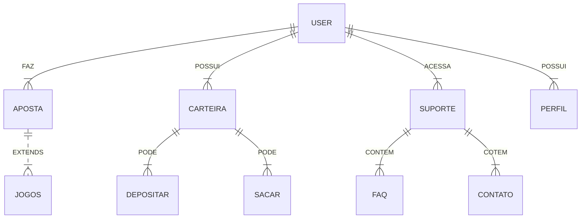

Atalho abrir markdown ctrl + k e apos solta e aperta V

Diagrama de Caso de Uso

```mermaid
erDiagram

    USER ||--|{ APOSTA : FAZ
    USER ||--|{ CARTEIRA :POSSUI
    CARTEIRA ||--|{ DEPOSITAR : PODE
    CARTEIRA ||--|{ SACAR : PODE
    APOSTA ||..|{ JOGOS : EXTENDS
    USER ||--|{ SUPORTE : ACESSA
    USER ||--|{ PERFIL : POSSUI
    SUPORTE||--|{ FAQ : CONTEM
    SUPORTE||--|{ CONTATO : COTEM

```
